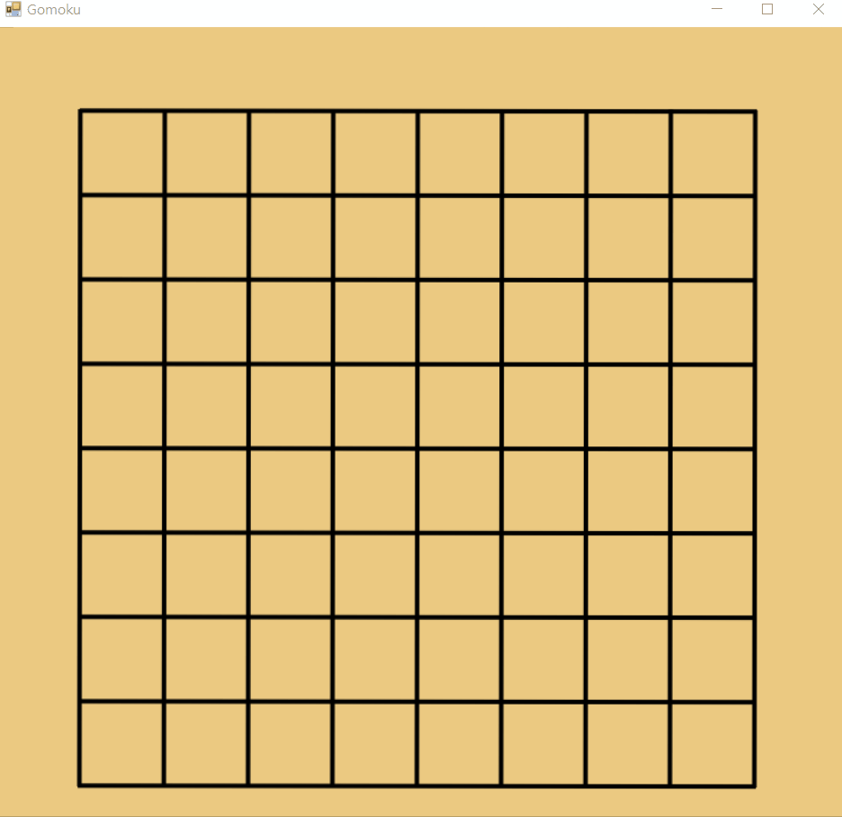

# Csharp_Gomoku(五子棋)
利用物件導向的概念設計此專案，使程式更讓人易於解讀與維護，利用的概念有封裝、繼承及覆寫

# 程式設計流程
1. 利用Windows Form設計遊戲介面
2. 建立棋子，使用者於介面點滑鼠後。顯示棋子
3. 判斷棋盤上正確可放旗子的交叉點，若是對的位置，則改變游標告知使用者可放
4. 棋子可正確放上交叉點後，每下玩一次黑棋就要換白旗下
5. 每下完一次棋，就要以該棋為中心，四周尋找是否有相同顏色的旗子，若有則以該方向尋找是否連續5個相同的棋子
6. 若有找到連續5個相同的棋子，則該顏色玩家獲勝，反之則繼續遊戲

